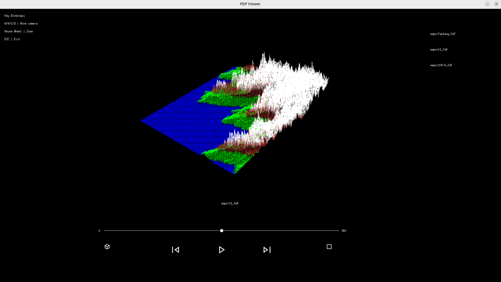

# FDF - 3Dマップビューワー

このプロジェクトは、42の課題「FDF」で制作した **3Dワイヤーフレームマップビューワー** です。  
`.fdf` フォーマットの地形データを読み込んで、**立体的な描画**を行います。

**MiniLibX** ライブラリを使用してGUIを構築し、マウス操作やキーボード操作に対応しています。  
使っている外部関数は `malloc` とシステムコール（`open`, `read`, `write`, `close`, `exit`）のみで、それ以外の関数（文字列処理など）はすべて**自作**しています。

---

## 🖥️ 実行画面



---

## 🔧 インストール方法（Linuxのみ対応）

```bash
git clone https://github.com/yourname/fdf.git
cd fdf
make
````

> 📌 MacOS や Windows では動作しません（Linux専用）

---
## 🎮 使用例

```bash
./fdf maps/t1.fdf maps/t2.fdf
```

> 📌読み込むファイル名は、mapsディレクトリ内にあるファイルから選んでください。  
> 📌 `.fdf` 拡張子のファイルにのみ対応しています。  
> 📌複数ファイルを指定することで、プログラム内で切り替えて再生することができます。  
> 📌読み込みの上限は１０ファイルです。  

---
## 🕹️ 操作方法

* `W / A / S / D`：カメラ移動
* `マウスホイール`：ズームイン／アウト
* `ESC`：終了

---
## 📂 機能概要

* `.fdf` ファイルの複数読み込みに対応
* UI上でマップファイルの一覧表示と選択
* UIボタンによる再生・一時停止・前後切り替え操作

---

## 🧰 使用ライブラリ：MiniLibXとは？

[MiniLibX](https://harm-smits.github.io/42docs/libs/minilibx) は、42の課題で使われる最小構成のグラフィックライブラリで、以下のような操作が可能です：

* ウィンドウの作成
* ピクセル単位での描画
* キー入力／マウス入力の取得
* イベントループの実装

このプロジェクトでは、MiniLibXの基本的な描画機能とイベントハンドリングのみを利用しています。

---

## 📋 技術仕様

### アーキテクチャ概要

```
プロジェクト構造:
├── src/               # メインソースコード
│   ├── callbacks/     # UIボタンコールバック
│   ├── drawing/       # 描画処理
│   ├── input/         # キーボード・マウス入力
│   ├── load_map/      # .fdfファイル読み込み
│   ├── math/          # 数学演算（色補間など）
│   ├── projection/    # 投影変換
│   └── transform/     # 座標変換
├── includes/          # ヘッダファイル
├── maps/              # サンプルマップファイル
├── ft_printf/         # 自作printf関数
└── minilibx-linux/    # グラフィックライブラリ
```

### 主要技術要素

#### 1. 投影システム
- **等角投影 (Isometric Projection)**
  - 30°固定角度による2.5D描画
  - 座標変換式: `x = (x - y) * cos(π/6)`, `y = (x + y) * sin(π/6) - z`
  
- **透視投影 (Perspective Projection)**
  - 視点からの距離に応じた遠近法描画
  - FOV: 800px、視点距離: 1000px

#### 2. 描画アルゴリズム
- **Bresenham直線描画アルゴリズム**
  - ピクセル単位での正確な線描画
  - 色の線形補間 (Linear Interpolation) 対応

- **カラーグラデーション**
  - RGB値による線形補間
  - 高度に応じた色の変化表現

#### 3. 地図変換機能
- **球面マッピング**
  - 平面データを球面座標系に変換
  - 球面座標式: `r = radius + height`

- **Z軸スケーリング**
  - 高度データの自動正規化
  - 動的なZ軸倍率調整

#### 4. UI システム
- **イベントドリブン設計**
  - マウスクリック・ホイール・キーボード対応
  - リアルタイム再描画システム

- **カスタムUI要素**
  - 自作ボタンコンポーネント
  - XPM画像アイコン対応

### 使用データ構造

```c
typedef struct s_vec3 {
    float x, y, z;     // 3D座標
} t_vec3;

typedef struct s_projinfo {
    float scale;        // 表示倍率
    float z_scale;      // Z軸倍率
    float offset_x, offset_y;  // オフセット
    float z_angle;      // 回転角度
} t_projinfo;

typedef struct s_map {
    int width, height;   // マップサイズ
    t_point **points;    // 標高・色データ
} t_map;
```

### パフォーマンス仕様
- **最大マップサイズ**: 制限なし（メモリ依存）
- **最大ファイル数**: 10個まで同時読み込み
- **フレームレート**: 60FPS想定
- **メモリ管理**: 完全手動管理（malloc/free）

### 対応フォーマット
- **入力**: `.fdf` 形式（標高データ + 16進数カラー）
- **出力**: X11ウィンドウ（1920x1080推奨）

---

## ⚠️ 注意事項

* `.fdf` ファイル以外には対応していません
* Linux 環境でのみ動作確認・テストを行っています

---
